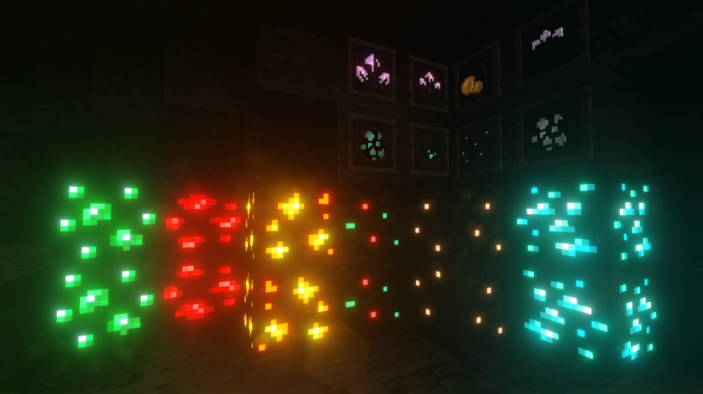

# Effects Informations

This page lists technical information for all the effects available in Post-Processing FX.

> Note: You can also see all effect information using Feather in GameMaker.


# Bloom

The Bloom effect makes bright areas in your image glow. To do this, it creates fringes of light that extend from bright areas in your image. This simulates the effect a real-world camera gives when light overwhelms the lens.

The Bloom effect also has a Dirt lens feature, which you can use to apply a full-screen layer of smudges or dust to diffract the Bloom effect.

Trust me, this effect can improve the look of your game a lot if set up right!




Yes! The bloom was created on top of the last image, without any additional editing, just Post-Processing FX!

## Properties <!-- {docsify-ignore} -->

```gml
FX_Bloom(enabled, iterations, threshold, intensity, color, white_amount, dirt_enable, dirt_texture, dirt_intensity, dirt_scale, downscale, debug);
```

| Name | Description |  
|-----------|:-----------|  
| enabled | Defines whether the effect starts active or not. |  
| iterations | Sets Bloom’s scattering, which is how far the effect reaches. Max: 16. recommended: 4 to 8. |  
| threshold | Set the level of brightness to filter out pixels under this level. 0 above; 0 means full brightness. |  
| intensity | Set the strength of the Bloom filter. 0 to 5 recommended. |  
| colorr | The color that is multiplied by the bloom’s final color. |  
| white_amount | The How close Bloom will be to white in saturated light |  
| dirt_enable | Defines whether to use dirt textures. |  
| dirt_texture | The texture id used for the Dirt Lens. Use sprite_get_texture() or surface_get_texture(). |  
| dirt_intensity | The intensity of Dirt Lens. 0 to 3 recommended. |  
| dirt_scale | The scale of Dirt Lens. 0.25 to 3 recommended. |  
| downscale | Sets the downscale of the Bloom, this changes the performance. 1 is full resolution. |  
| debug1 | Allows you to see the final bloom result alone. |  
| debug2 | Allows you to see exactly where the bloom is hitting the light parts. |  


## Details <!-- {docsify-ignore} -->

You don't need to use a Dirt Lens texture, just don't reference one.

## Performance <!-- {docsify-ignore} -->

The number of **iterations** influences the amount of batch breaks and texture swaps. And high **downscale** influences in GPU usage.


<br><br><br><br>
# Chromatic Aberration

The Chromatic Aberration effect splits color along boundaries in an image into their red, green, and blue channels. This reproduces the effect a real-world camera produces when light refracts and causes the wavelengths to disperse in the lens.

PPFX provides support for red/blue and green/purple spectral. You can define spectral colors by using a LUT texture.


## Properties <!-- {docsify-ignore} -->

```gml
FX_ChromaticAberration(enabled, intensity, angle, only_outer, center_radius, blur_enable, prisma_lut_tex);
```

| Name | Description |  
|-----------|:-----------|  
| enabled | Defines whether the effect starts active or not. |  
| intensity | How much the channels are distorted. 0 to 50 recommended.
| angle | The chromatic angle. Default it 35.
| only_outer | Defines whether the effect will be applied only to the edges, or entirely.
| center_radius | How much the effect is blended with the center. 0 to 3 recommended.
| blur_enable | Defines whether to blur the chromatic effect.
| prisma_lut_tex | The spectral LUT texture, used to define the spectral colors.


# WIP...

I'll finish writing in another life lmao
